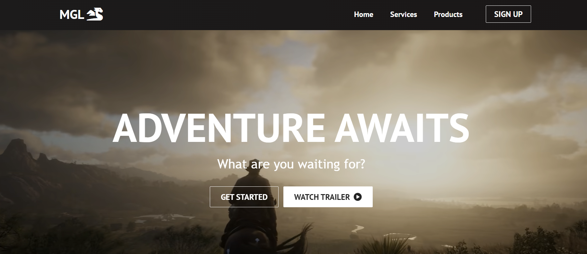

# MyGameList
A responsive React-based site representing MyGameList

 

## Stack used:
- ReactJS
- CSS

## Features:
- Fully responsive page to display about games and game-services.
- React components and React hooks are used for simple and flexible code
- CSS properties like Flex, Grid are used.
- Modern Design.
- Hosted in Vercel.

## Link:
- [MyGameList](https://mygamelist.vercel.app/)
